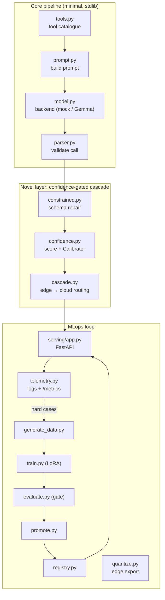
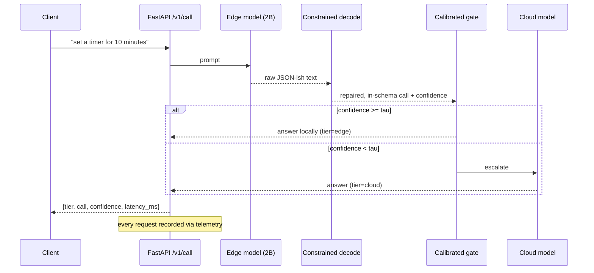

# Architecture

FunctionGemma-edge-AI is deliberately split into three layers you can read
independently: a **minimal core**, a **novel serving layer**, and an
**industrial MLops loop** around them. Each box below maps to one small module.

## The three layers

## Request path at serving time

## Why this shape

| Concern | Where it lives | Design choice |
| --- | --- | --- |
| What can be called | `tools.py` + `data/tools_catalog.json` | one JSON contract shared by data, eval, serving |
| Making a small model reliable | `prompt.py`, `constrained.py` | strict output contract + decode-time schema projection |
| Knowing when to defer | `confidence.py`, `cascade.py` | calibrated abstention + edge→cloud cascade |
| Shipping safely | `evaluate.py`, `promote.py`, `registry.py` | eval gate guards the production pointer |
| Fitting on-device | `quantize.py` | int4/int8 export, footprint budget |
| Operating it | `serving/app.py`, `telemetry.py` | health, Prometheus metrics, event log |

## The feedback loop

The event log written by `telemetry.py` is not just for dashboards: replaying it
surfaces the requests that escalated or abstained — exactly the hard cases worth
adding to the next `generate_data.py` run (or labelling with a teacher model for
distillation). That closes the loop from **production → data → training →
evaluation → production**, which is the whole point of an MLops setup.
